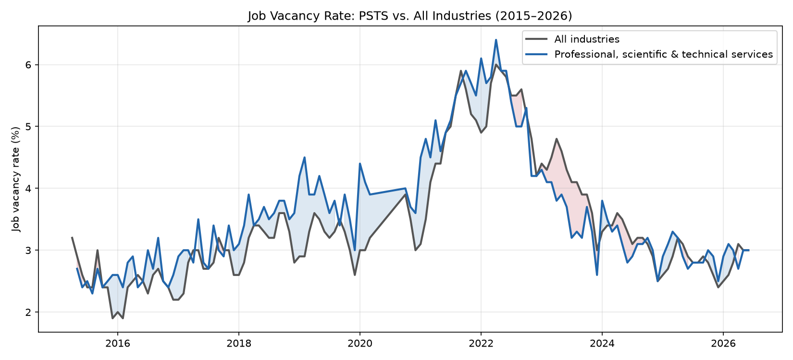
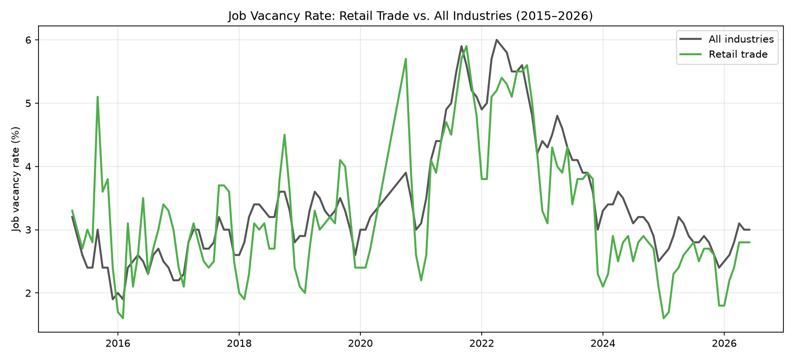
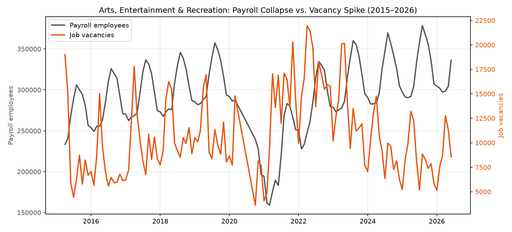

# Employment Industry Analysis


An end-to-end SQL and Python analysis of Canadian job vacancy rates by industry sector (2015–2026), examining how individual sectors diverged from the national labour market — including a volatility pattern in professional/technical services and a pandemic-era payroll collapse and rehiring crunch in arts and entertainment.

---

## Research Question

How have job vacancy rates diverged across Canadian industry sectors since 2015, and how did individual sectors' relationships to the broader labour market shift through the pandemic period?

---

## Key Findings

1. **Professional, Scientific and Technical Services (PSTS) is structurally more volatile than the broader labour market.** Its vacancy rate ran an average of 0.18 points above the national baseline, with the gap ranging from −1.0 to +1.6 across the series. PSTS peaked in the same month as the broader economy (April 2022, 6.4% vs. 6.0%), but the spread turned negative around July 2022 and stayed mostly negative through early 2024 — PSTS appears to have led both the tightening phase and the subsequent cooldown, overshooting the baseline in both directions rather than simply tracking it at a higher level.

2. **Retail trade tracked the broader economy closely throughout, including the pandemic.** Its spread versus baseline averaged −0.18 with a narrow range (−1.2 to +2.1), and showed no meaningful shift during the pandemic window specifically — one of the more stable sectors in the dataset.

3. **Arts, Entertainment and Recreation saw severe payroll contraction followed by an acute rehiring crunch — not reduced demand.** Payroll fell roughly 25% from 2019 levels (from ~313,000 to ~234,000 average during the pandemic low). Contrary to an initial hypothesis that this reflected suppressed demand, raw job vacancy counts roughly doubled from pre-pandemic levels through 2021 (e.g., 17,060 vacancies in April 2021 vs. 8,000–12,000/month in 2019) even as payroll remained well below its pre-pandemic baseline — producing the highest vacancy rates observed for any sector in this dataset.

---

## Results







---

## Methodology
1. Data was imported from a raw CSV containing monthly labour market indicators (Statistics Canada, Table 14-10-0372-01).
2. NAICS sector labels were cleaned and split into sector name and code.
3. Date fields were parsed from StatsCan's `YY-Mon` format into standardized datetimes.
4. The long-format source (three rows per sector-month) was pivoted into one row per sector-month, with vacancies, payroll employees, and vacancy rate as separate columns.
5. Data was loaded into a local SQLite database and queried with SQL — self-joins to compare sectors against the national baseline, conditional aggregation (`CASE`/`UNION`) to compare multiple sectors at once.
6. Results were visualized with matplotlib, including a dual-axis chart to compare vacancies and payroll on different scales.

---

## Data Quality Notes

- **Utilities was excluded from sector-level comparisons.** Its vacancy estimates were suppressed (StatsCan quality flag `F`) in a large share of periods, and even non-suppressed estimates were consistently rated lower quality (C–E) than other sectors throughout the series — a reflection of the sector's small sample size in the underlying survey, not an analytical choice to exclude it.
- StatsCan quality flags (`A`–`F`) were retained per measure (vacancies, payroll, rate) rather than discarded, since reliability differs by measure within the same sector-month — e.g., payroll counts are typically high-quality (`A`) even in sector-months where vacancy estimates are suppressed.
- No values were imputed. Suppressed (`F`-flagged) observations were left as `NULL` and excluded naturally by SQL and pandas aggregate functions rather than filled or treated as zero.
- The survey was suspended April–September 2020, creating a gap in the time series during the earliest months of the pandemic.

---

## Tech Stack
- **Python**: Core scripting and data processing
- **Pandas**: Data cleaning, reshaping, and database loading
- **SQLite**: Local relational database for structured analysis
- **SQL**: Joins, conditional aggregation, and time-window filtering used for all comparative analysis
- **Matplotlib**: Data visualization, including dual-axis charting

---

## Project Structure
- `Data/` — Raw source CSV file used for the analysis
- `figures/` — Saved output charts generated by the visualization script
- `load.py` — Data loading, cleaning, pivoting, and SQLite import
- `visuals.py` — SQL queries and chart generation
- `job_vacancies.db` — SQLite database created from the processed dataset
- `.vscode/` — Local editor configuration
- `.gitignore` — Files excluded from version control

## File Tree
```text
Employment Industry Analysis/
├── .gitignore
├── .vscode/
│   ├── settings.json
│   └── tasks.json
├── Data/
│   └── raw_job_vacancies.csv
├── figures/
│   ├── arts_payroll_vs_vacancies.png
│   ├── psts_vs_baseline.png
│   └── retail_vs_baseline.png
├── job_vacancies.db
├── load.py
├── README.md
└── visuals.py
```

---

## Getting Started

### Prerequisites
- Python 3.x
- `pandas`
- `matplotlib`

### Installation
1. Clone the repository:
   ```bash
   git clone https://github.com/Jacob-Freij/Industry-Analysis.git
   ```
2. Navigate into the project folder:
   ```bash
   cd Industry-Analysis
   ```
3. Install the required Python packages:
   ```bash
   pip install pandas matplotlib
   ```

### Run the project
Load the raw data into SQLite:
```bash
python load.py
```

Generate the charts:
```bash
python visuals.py
```

---

## Limitations

- This is observational time-series data; no causal claims are made about *why* sectors diverge from the baseline.
- The dataset covers Canada nationally only — no provincial or regional breakdown.
- The 2-digit NAICS level is broad; sub-sector dynamics (e.g., within Professional, Scientific and Technical Services) are not visible at this level of aggregation.
- Only three sectors were examined in depth; broader patterns across all 20 sectors were not systematically tested.

---

## Future Work

- Extend the sector-by-sector comparison to all 20 sectors systematically, rather than three selected for hypothesis testing.
- Join against a wage-by-sector dataset (a separate, shorter StatsCan series) to examine whether vacancy rate divergence coincides with wage divergence.
- Break down Professional, Scientific and Technical Services at the 3-digit NAICS level to test whether the volatility is broad-based or concentrated in specific sub-sectors (e.g., computer systems design).

---

## Repository
- [GitHub](https://github.com/Jacob-Freij/Industry-Analysis)
